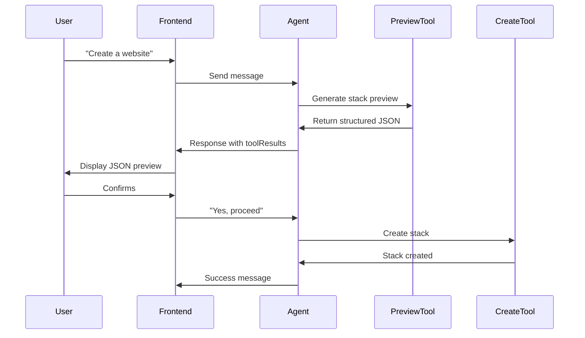

# JSON Preview Feature - Changes Summary

## Overview
Enhanced the onboarding agent to return JSON previews as structured objects instead of text, enabling frontend applications to directly access and display the JSON data.

---

## Files Modified

### 1. `/src/mastra/tools/contentstack-tools.ts`

**Added 3 New Preview Tools:**

#### `previewStackTool`
- **Purpose**: Generate stack JSON preview before creation
- **Input**: Stack name, description, master_locale
- **Output**: Structured JSON object with stack preview
```typescript
{
  preview: {
    stack: { name, description, master_locale }
  },
  message: string
}
```

#### `previewGlobalFieldsTool`
- **Purpose**: Generate global fields JSON preview
- **Input**: Array of global_fields from `generateContentModelTool`
- **Output**: Array of global field previews
```typescript
{
  previews: [{ global_field: {...} }],
  count: number,
  message: string
}
```

#### `previewContentTypesTool`
- **Purpose**: Generate content types JSON preview
- **Input**: Array of content_types from `generateContentModelTool`
- **Output**: Array of content type previews
```typescript
{
  previews: [{ content_type: {...} }],
  count: number,
  message: string
}
```

---

### 2. `/src/mastra/agents/onboarding-agent.ts`

**Updated Agent Configuration:**
- Imported 3 new preview tools
- Added preview tools to agent's tools configuration
- Updated instructions to use preview tools in workflow

**Key Instruction Changes:**

1. **Phase 1 - Stack Creation**
   - Now calls `previewStackTool` before creating stack
   - Returns structured JSON for frontend to access
   - Still shows formatted JSON in chat for visibility

2. **Phase 3 - Content Model Preview**
   - Calls `previewGlobalFieldsTool` with global_fields array
   - Calls `previewContentTypesTool` with content_types array
   - Both return structured JSON objects
   - Frontend can parse and display these directly

3. **Critical Rules Updated**
   - Must use preview tools before any creation
   - Preview tools return structured data for frontend
   - Maintains conversational flow while providing structured data

---

## New Files Created

### 3. `/FRONTEND_API_GUIDE.md`

Comprehensive guide for frontend developers showing:
- How to access preview JSON from agent responses
- Response structure for each preview tool
- Complete integration example
- React component example
- Benefits of structured data approach

---

## How It Works

### Before (Text-based):
```
Agent: "Here's the stack JSON:
```json
{
  "stack": {
    "name": "My Stack"
  }
}
```
Would you like to proceed?"
```

Frontend had to:
1. Parse text response
2. Extract JSON from markdown code blocks
3. Parse JSON string

### After (Structured):
```typescript
// Agent calls previewStackTool internally
const response = await agent.chat(threadId, message);

// Frontend directly accesses structured data
const stackPreview = response.toolResults
  .find(r => r.toolName === 'preview-stack-json')
  ?.result.preview;

// stackPreview is already a parsed JSON object
displayJSON(stackPreview);
```

---

## Benefits

1. **No String Parsing**: Frontend receives proper JSON objects
2. **Type Safety**: Can use TypeScript interfaces
3. **Easier Integration**: Direct access via `toolResults`
4. **Flexible Display**: Use any JSON viewer component
5. **Better UX**: Rich preview experiences in UI
6. **API-Friendly**: Works perfectly with REST/GraphQL frontends
7. **Maintains Chat Flow**: Still shows JSON in conversation for visibility

---

## Usage Flow



---

## Testing the Feature

### Test with CLI or API:

```bash
# Start conversation
curl -X POST http://localhost:3000/api/chat \
  -H "Content-Type: application/json" \
  -d '{
    "threadId": "test-123",
    "message": "Create a corporate website"
  }'

# Agent will ask questions...

# After answering, check response for toolResults
# Look for:
# - preview-stack-json
# - preview-global-fields-json  
# - preview-content-types-json
```

### Example Response:

```json
{
  "text": "Here's the stack JSON preview. Would you like to proceed?",
  "toolResults": [
    {
      "toolName": "preview-stack-json",
      "success": true,
      "result": {
        "preview": {
          "stack": {
            "name": "Corporate Website",
            "description": "Content for corporate site",
            "master_locale": "en-us"
          }
        },
        "message": "Stack JSON preview generated..."
      }
    }
  ]
}
```

---

## Migration Notes

### For Existing Integrations:

1. **No Breaking Changes**: Text responses still work
2. **Additive Feature**: Preview data is additional in `toolResults`
3. **Opt-in Usage**: Frontend can choose to use structured data or text
4. **Backwards Compatible**: Old implementations continue to work

### For New Integrations:

1. Use `toolResults` to extract preview JSON
2. Filter by `toolName` to find specific previews
3. Display using your preferred JSON viewer
4. Send confirmation messages to proceed

---

## Next Steps / Recommendations

1. **Frontend Implementation**: Build preview UI components
2. **Testing**: Test with various content model configurations
3. **Documentation**: Share API guide with frontend team
4. **Validation**: Add JSON schema validation for previews
5. **Error Handling**: Handle cases where preview generation fails
6. **User Feedback**: Collect feedback on preview UX

---

## Summary

✅ **3 new preview tools** added to return structured JSON  
✅ **Agent updated** to use preview tools in workflow  
✅ **Frontend guide** created with examples  
✅ **No breaking changes** - fully backwards compatible  
✅ **Better UX** - Rich, interactive JSON previews possible  
✅ **API-first** - Works great with modern frontends  

The system now provides a clean separation between conversational AI responses and structured data previews, making it easy for frontends to build rich, interactive user experiences.

